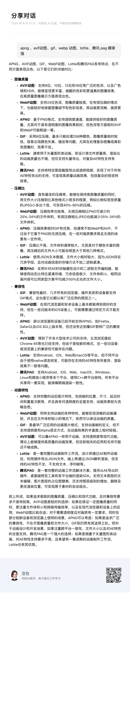

# 动图优化

Glide中存在加载webp和avif动图AnimatedWebpDecoder/AnimatedImageDecoder类，webp在Android P +支持，avif在Android S+，那么低于P以下我们可以使用gif或者lottie播放

# GIF

## Android's FrameSequence vs. Glide's GifDrawable

相比较Glide实现的GifDrawable，FrameSequenceDrawable到底哪里好?

| ...    |GifDrawable|FrameSequenceDrawable|
|--------| ---| ---|
gif动图  |支持|支持
webp动图 |不支持|不支持
集成包大小  | 仅有15个文件| 117kb起步
缓存     | BitmapPool| 两个Bitmap

## GifDrawable的卡顿 与 优化

卡顿根源: 串行渲染,GifDrawable动图加载时两帧是串行的，如果其中一帧耗时严重就会出现掉帧的问题，因为StandardGifDecoder只会保留一帧的数据,

[//]: # (每次获取当前要绘制的帧就会从BitmapPool中获取新的Bitmap，这样就会同时存在两个Bitmap造成内存过高)

优化

- 并行渲染：FrameSequenceDrawable在其他线程解码数据，在主线程绘制数据
- FrameSequenceDrawable永远只会使用两个Bitmap(frontBitmap和backBitmap)，frontBitmap用于给屏幕渲染，backBitmap用于存放解码数据，在绘制下一帧的时候swap两个Bitmap，不会产生多余的Bitmap 

# Lottie

lottie比起gif体积更小

# Pag
腾讯 pag

